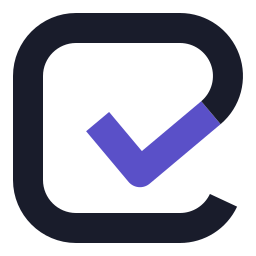

<p align="center">
  <picture>
    <source media="(prefers-color-scheme: dark)" srcset="assets/logo/mark-dark.svg">
    
  </picture>
</p>

<h1 align="center">attest_tag</h1>

<p align="center">
  <a href="LICENSE"></a>
  
  
</p>

An AI teammate for Slack — and for Microsoft Teams beside it — that runs on open-weight models
through any OpenAI-compatible endpoint (OpenRouter + GLM-5.3-Flash by default). One Go binary
with an embedded admin console, SQLite by default or Postgres when you give it one, and signed
HTTP event delivery from both platforms.

People @mention it or DM it. It reads the thread, calls tools — Slack history and search,
internal documents, the web, connected services such as GitHub or ClickUp — streams the answer
back into the thread, and remembers facts and schedules routines when asked. Admins manage what
it may reach, per channel, from a console at `/admin/`.

**It never hands a key to the model.** Connection credentials are sealed at rest and injected at
the edge by a proxy, so a tool call reaches the service it is for and the model sees the answer,
never the secret.

## Run it

```bash
git clone https://github.com/Attest-Tag/attesttag && cd attesttag
./deploy/local/bootstrap.sh
docker compose --profile quicktunnel up -d
docker compose logs quicktunnel      # the https URL for your Slack app
```

That is a working deployment: the bot's container with a volume for the database and one for
the documents, and a public HTTPS address with no account and no domain. The bot restarts until
`.env` has what it cannot start without, which is the next two steps — so a restart loop on the
first `up -d` is expected. **Make your own Slack app** — the app belongs to your workspace and its
token never leaves your deployment — and point it at that address:
[`guide/slack-app.md`](guide/slack-app.md) walks the whole thing, or run
`BASE_URL=https://<that address> ./deploy/slack/manifest.sh` and paste what it prints. Put the
app's signing secret, client id and client secret into `.env` with a model key
(`OPENROUTER_API_KEY`, from [openrouter.ai/keys](https://openrouter.ai/keys)), and run the same
`docker compose --profile quicktunnel up -d` again: it recreates the bot and leaves the tunnel,
and its address, alone. Open the console and sign up; the first sign-up founds the deployment
and everybody after arrives by invitation.

Until the first release is tagged there is no published image to pull. Build one from the
checkout — `docker build -t attesttag-local .` — and put `ATTEST_IMAGE=attesttag-local` in
`.env`.

The one thing that trips people up: **Slack will not deliver events to localhost**, and there is
no Socket Mode fallback here, so a public HTTPS address is required rather than convenient.
[`deploy/docs/https.md`](deploy/docs/https.md) covers the three ways to get one.

## Deploy it somewhere

**Or have an agent do it.** Clone the repository, open Claude Code, Codex, Cursor or any agent
that runs shell commands *in that directory*, and say "read `AGENTS.md`, then install this on
Google Cloud". → [Installing it with a coding agent](guide/install-with-an-agent.md)

[`deploy/`](deploy/README.md) has one folder per platform. Each holds a README that covers that
platform end to end and a script that is idempotent — rerunning it is how you ship a new
version.

| | | |
|---|---|---|
| [**Docker**](deploy/local/README.md) | a laptop, or one VM anywhere | `docker compose up -d` |
| [**Google Cloud**](deploy/gcp/README.md) | Cloud Run, with GCS or Cloud SQL. What the hosted service runs | `ENV_FILE=.env ./deploy/gcp/cloudrun.sh` |
| [**AWS**](deploy/aws/README.md) | ECS Fargate behind an ALB, documents in S3 | `./deploy/aws/fargate.sh` |
| [**Azure**](deploy/azure/README.md) | Container Apps, with Postgres or a bucket | `./deploy/azure/containerapps.sh` |
| [**Kubernetes**](deploy/helm/README.md) | anywhere, one chart, three shapes | `helm install` |

They are all the same container — `ghcr.io/attest-tag/attesttag`, published by each release for
`linux/amd64` and `linux/arm64`, signed, with provenance and an SBOM. (The fix-job worker images
beside it are `linux/amd64` only.) Point it at a managed Postgres and a bucket and it runs
somewhere none of these folders mentions.

**Three things decide whether a deployment works**, and they are the same everywhere: a public
HTTPS origin; **always-on CPU**, because the Slack dispatcher, the routine scheduler and the
ingest loop all run *between* requests and a platform that freezes an idle container will ack
Slack's event and then never do the work; and a `MASTER_KEY` backed up somewhere else, because
it seals every stored credential and nothing can recover one that is lost.
[`deploy/docs/platforms.md`](deploy/docs/platforms.md) is the page to read before choosing — it
has the two or three shapes each cloud can run this in, and why the AWS folder builds Fargate
rather than App Runner, which throttles idle CPU.

**Storage.** By default the database is SQLite on a volume and documents are a folder on one —
which is a real deployment, not a demo, and the right answer for a single box. Point
`DOCS_S3_URL` at any S3-compatible bucket and the documents *and* a continuous replica of the
database live there, so one instance survives losing its disk. Add `DATABASE_URL` for any
Postgres and there is no local state left, which is what lets it scale past one replica. Would
rather not sign up for either? Compose profiles and two Helm values run a Postgres and a MinIO
beside the bot instead. [`deploy/docs/storage.md`](deploy/docs/storage.md) has the recipes and
where to get each.

## What it does

- **Answers in threads.** Slack is the source of truth: the context is rebuilt from the thread
  every turn, so edits and deletions are noticed. Answers stream in with a status line, long
  ones arrive as a file, and `stop` cancels a run mid-flight. Optionally it reads every message
  in a channel and decides for itself whether to say anything. → [Using it in Slack](guide/slack.md)
- **Works in Microsoft Teams too.** The same bot, the same console and the same connections in
  Teams channels and chats, beside Slack. A deployment still starts with a Slack app's
  credentials, even one that will only ever answer in Teams. → [Microsoft Teams](guide/msteams.md)
- **Has tools without being configured.** Slack history and search, RAG over your documents,
  web search and page fetch, artifacts it writes into the thread, memory it keeps per channel
  or per person, and cron routines it schedules when asked. → [Using it in Slack](guide/slack.md)
- **Reaches outside services without holding a key.** Connections are credentials an admin
  pastes once, grouped into bundles and attached per channel. A proxy injects them at the
  network edge, holds every write for a Confirm button in the thread, scrubs the response and
  audits the call. Presets for thirty-odd services, remote MCP servers, and per-person OAuth for
  mailboxes and calendars. → [Connections](guide/connections.md)
- **Fixes code and opens a pull request.** A separate container clones the repository, works out
  how to build and test it, makes the change, runs the gates again, and opens a draft PR with the
  evidence. It never merges and never pushes to the base branch. → [Fix jobs](guide/fix-jobs.md)
- **Is administered from a console.** Served by the same binary: scopes, bundles, documents,
  memory, routines, jobs, artifacts, activity, an audit log, roles, budgets. Sign in with a
  password, Slack, Microsoft or your own OpenID Connect provider, with two-factor on top.
  → [Admin console](guide/console.md)
- **Has an API, and an MCP server.** `/v1` with keys that carry exactly their maker's access:
  keep documents in step with somewhere else (PDFs included), make and change routines, and read
  what the bot did and spent. The same routes are MCP tools for Claude, Cursor or any MCP client,
  connected by signing in and pressing Allow, or with a key.
  → [Developer API](guide/api.md) · [MCP server](guide/mcp.md)
- **Assumes tool output is hostile.** Prompt-injection framing, credential isolation,
  human-in-the-loop writes, approval tiers a requester cannot approve from by default, SSRF guards, and an
  audit row for every turn, tool call and proxied request. → [Guardrails](guide/security.md)

## Documentation

[**guide/**](guide/README.md) is the full documentation. The pages people open first:

| | |
|---|---|
| [Make your own Slack app](guide/slack-app.md) | From an empty dashboard to a bot answering in a channel, with every scope explained |
| [Microsoft Teams](guide/msteams.md) | The same bot in Teams: registering it with Microsoft and connecting an organisation |
| [Installing it with a coding agent](guide/install-with-an-agent.md) | Hand the whole install to Claude Code, Codex or any harness — and what it will stop and ask you for |
| [Deploying it](deploy/README.md) | A folder per platform — Docker, Google Cloud, AWS, Azure, Kubernetes — storage, and what actually decides whether a deployment works |
| [Configuration](guide/configuration.md) | Every environment variable and console setting |
| [Using it in Slack](guide/slack.md) | Threads, tools, memory, routines, commands, budgets |
| [Connections](guide/connections.md) | Reaching other services without the model ever seeing a credential |
| [Google](guide/google.md) | Mail and calendar on each person's own account, and a Drive folder mirrored into Documents |
| [MCP server](guide/mcp.md) | Claude, Cursor and any MCP client reading and changing what the bot knows, connected with OAuth or a key |
| [Architecture](guide/architecture.md) | The process, the files, the schema |
| [Building from source](guide/development.md) | Toolchains, running it locally, tests and evals |

## Status

The bot, the console, connections, routines, memory, documents, the developer API and fix jobs
all work and are in daily use. It has been running one organisation's Slack for months; this
repository is the same code, with the things that were specific to that deployment turned into
configuration.

What a self-hoster should know is still rough:

1. **The per-cloud scripts are newer than the rest.** The Google Cloud ones are what the hosted
   service deploys with and are exercised constantly. [`aws/`](deploy/aws/README.md) and
   [`azure/`](deploy/azure/README.md) were written against those providers' APIs and reviewed,
   not run daily against a live account — read what they are about to create before the first
   run. Each step is idempotent, so a failure part-way through is fixed by fixing the cause and
   rerunning.
2. **Fix jobs run everywhere, but only the Cloud Run path is exercised daily.**
   `WORKER_MODE=workers` turns them on and the bot works out which platform it is on. The
   platform piece is `deploy/gcp/worker.sh`, `deploy/aws/worker.sh` or `deploy/azure/worker.sh`
   (each creates the job and the IAM for it), the chart's `worker.enabled` on Kubernetes, or the
   `deploy/local/worker.yml` overlay on Docker. Everything that is not Cloud Run was written
   against those APIs and reviewed rather than run daily, the same caveat as the point above.
   Docker is the one with a real trade attached: it needs the Docker socket, which is root on the
   host. See [the worker section](deploy/docs/platforms.md#the-fix-job-worker).
3. **One writer, unless the rows are in Postgres.** SQLite replication is durability, not
   clustering. On a bucket that honours conditional writes, a second instance is refused the
   write lease: it answers 503 while it waits, and gives up and exits after ninety seconds,
   rather than corrupting anything. On one that does not, there is no lease at all — the bot
   says so at boot — and the deployment must run exactly one instance. Scaling past one instance
   means `DATABASE_URL`.
4. **Microsoft Teams is the newest part.** It uses the same turn path, tools and console as Slack,
   but it has had a small fraction of Slack's use, and a few things Slack does have no Teams
   equivalent yet — [the differences](guide/msteams.md) are listed.

Wanted, roughly in value order: feedback buttons under replies; Sign in with Slack on the
member Configure page; sources sync for a Confluence space or Notion database, the way a Drive
folder already does; pgvector once a corpus is big enough to need it; and Slack canvases.

## Contributing

Yes, please — including a corrected sentence in this file.
[`CONTRIBUTING.md`](CONTRIBUTING.md) covers getting it running, what the guard tests are for,
and the house style for comments and commit messages. The one non-obvious step is that
`make ui` has to come before `go build` (`make build` does both): the console is embedded with
`//go:embed`, so a tree that has never built it either fails to compile or, with only the
checked-in page shell in `ui/out`, builds a binary whose console does not load.

Found a vulnerability? Please do not open a public issue —
[`SECURITY.md`](SECURITY.md) says where to send it and what counts.

## Licence

[MIT](LICENSE).
